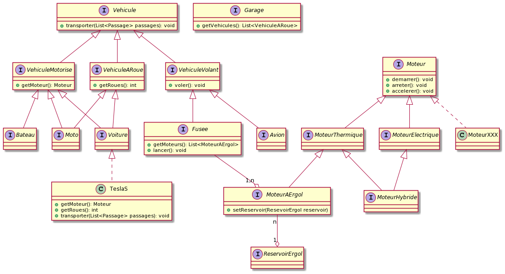

# Exercice des vehicules en Java et UML

## Lancer l'application dans Eclipse ou STS4

Dans eclipse, cliquer sur File>Import>General>Projects from Folder or Archive puis cliquer sur le bouton ```Next```.

Selectionner le dossier racine du projet grace au bouton ```Directory``` puis cliquer sur ```Next```

Clique droit sur le fichier ```formation.uml.voitures.DemoTesla.java``` puis ```Run as``` et ````Java Application```.

## Présentation
Le but de cette exercice est de decrire en UML une hiérarchie de classes et interfaces pour représenter des vehicules.

## L'énoncé:
Le but de cet   exercice est de créer un diagramme UML pour representé les vehicules, voitures et moteurs

Un Vehicule posséde une methode qui permet de transporter des passagés.

Un Vehicule a roue est un vehicule qui posséde des roues et qui peut rouler.

Une Voiture est un véhicule à roue.
Une moto est un véhicule à roue.
Un Avion est un véhicule qui peut voler.
Un bateau est un véhicule possédant un moteur.

Une voiture possède un moteur.

Un moteur peut démarrer, s'arreter et accélérer. Il est possible de connaitre sa puissance.

Il existe des moteurs thermiques, électriques ou hybrides.

Un moteur hybride est un moteur électrique et thermique.

Un moteur termique consome de l'essence et a besoin d'un reservoir. S'il n'y a plus d'essence il n'est plus possible de le demarrer.

Un moteur électrique a besoin d'une batterie.

Une moto possède un moteur.

Un avion possède plusieurs moteurs.

Un garage peut contenir un certain nombre de véhicules à roues.

Une fusée est un véhicule qui peut voler.

Une fusée possède un moteur ou plusieurs moteurs à ergol.

Un moteur à ergol a besoin d'un réservoir.

Une fusée peut être lancer ce qui allume se moteurs.

## Solution UML:

